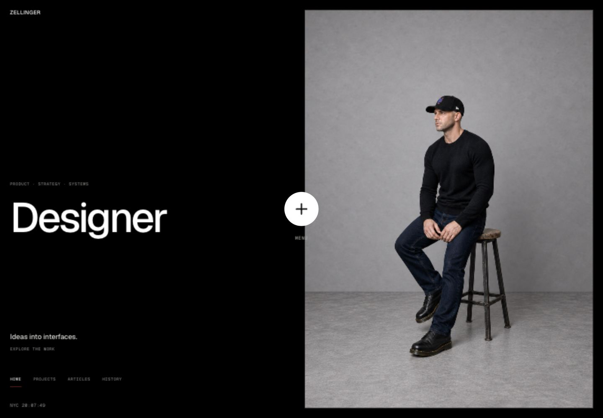
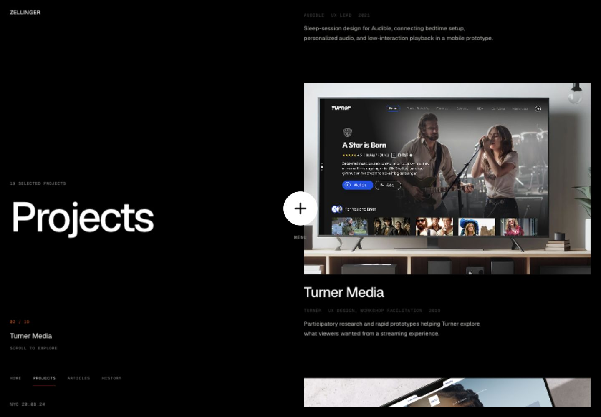
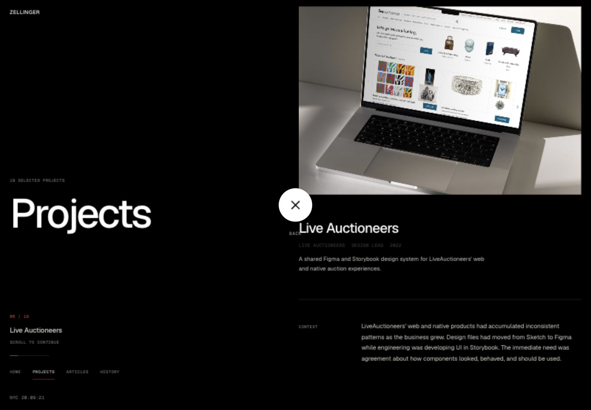
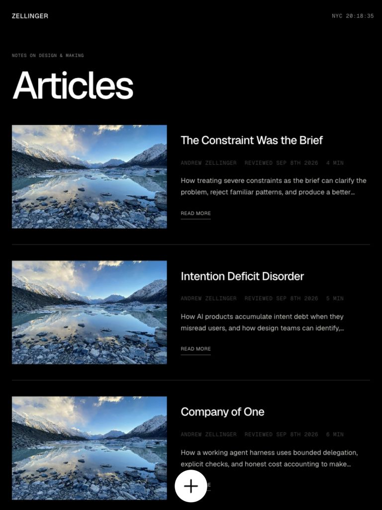
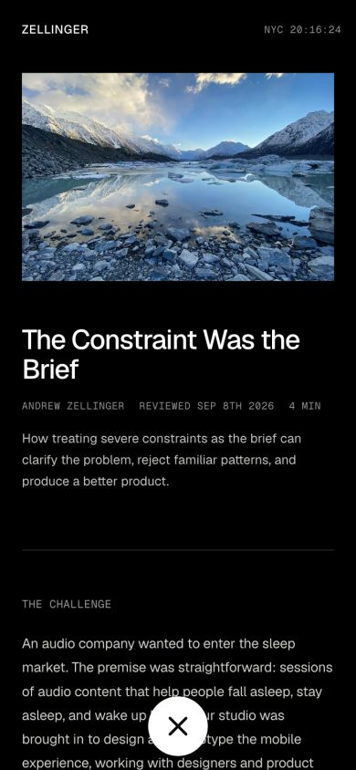
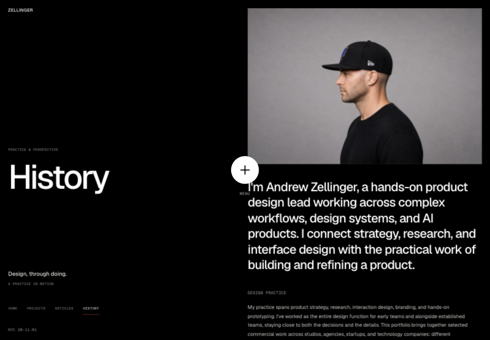
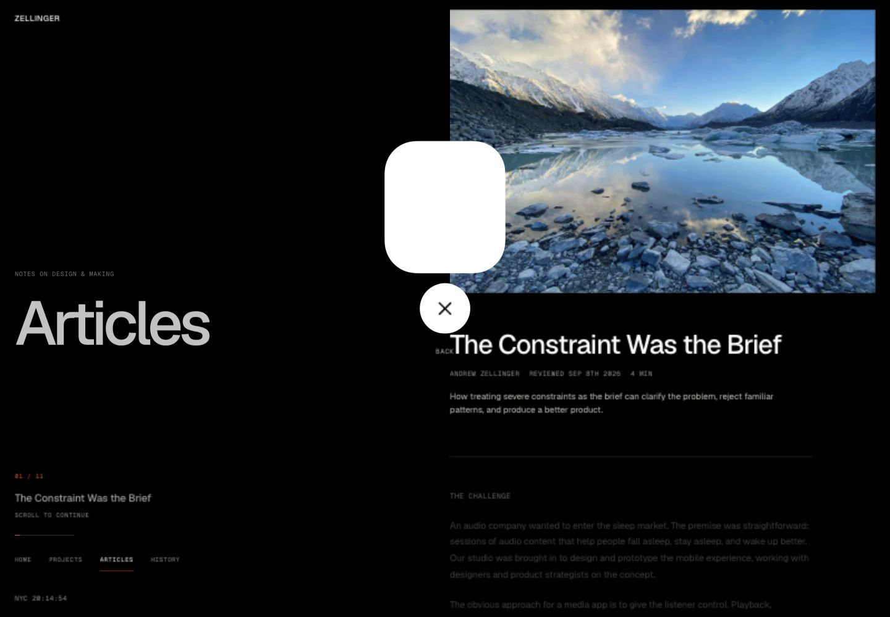
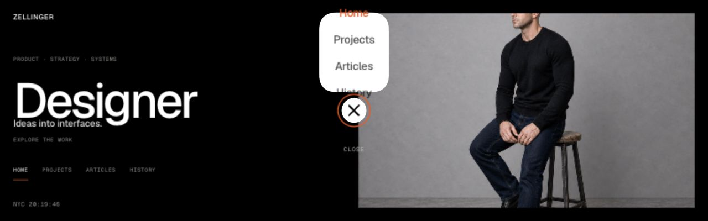

# Design and motion audit

**Latest implementation:** [one upward rail-sweep system](./unified-sweep/README.md) now covers all twelve top-level route pairs following Andrew's review. The original route-specific motion proposal below is superseded; main remains unchanged.

September 8, 2026 · Design-elevation experiment · Original audit and proposal

**Implementation update:** A1 stabilization and the A2 Home ↔ Projects motion proof are now implemented separately from main. See the [implementation and verification handoff](./implementation/README.md). The findings below preserve the pre-change audit; they are not a claim that the original defects remain unresolved.

**Verdict:** the split-screen foundation is strong enough for a much more distinctive motion system. The next improvement should be coordinated movement of the two columns, not more isolated fades. Resolve the confirmed initialization, contrast, and control-fit defects before expanding the choreography.

- Reviewed experiment: `codex/design-elevation`, commit `cd781ddd655623e1c401b55fe2e2fcc03d2b0be2`, local preview on port 5179.
- Protected baseline: local `main` and locally recorded `origin/main` remain `700ba4b88e5ccdd69247d9d8957b122970fb961d`; the main checkout is clean. No remote fetch or push was needed for this audit.
- This pass changes no application code. It records Andrew's new direction in the experiment's `AGENTS.md` and adds this audit, the motion proposal, screenshots, and measurements. Nothing is merged.
- Next: [proposed transition collection and implementation brief](./motion-proposal.md).

## 1. Scope and evidence

Inspected the four document shells and the six rendered page families: Home, Projects, Articles, History, project detail, and article detail. The source contains 19 projects and 11 articles: 34 canonical routes in total, sharing these six visual families. This is a whole-system source audit with representative runtime testing, not a claim that every paragraph of all 30 details was visually rechecked.

The current-run evidence includes 23 saved screenshots and 91 viewport-matched DOM measurements. These use the actual in-app browser viewport, not an iframe approximation. [Raw measurements](./measurements.json) record geometry and mode observations; they are not performance traces, and a successful resize measurement does not prove every debounced runtime rebuild has finished.

Widths checked across all six families: **320, 479, 480, 481, 599, 600, 767, 768, 769, 991, 992, 1440, 1920px**. Additional 390px phone captures, 768×1024 tablet captures, and 844×390, 1280×600, and 1280×400 height tests cover common and constrained shapes. No horizontal document overflow appeared in the retained measurements. There are significant hierarchy and overlay issues despite that result.

Current source tests were rerun: **93 passed, zero failed**. These tests did not catch the visible failures below. The build was not rerun: no application code changed, and existing packaging tests are not a fresh production build or deployment check.

## 2. Audited flow

| Step | Surface/action | Health | Evidence and observation |
|---|---|---|---|
| 1 | Home, desktop and phone | Strong foundation | Stable portrait, clear split, legible main title. Secondary directory and contextual copy are small; mobile loses the desktop contextual layer. |
| 2 | Projects collection → case study | Functional; motion fragmented | Distinct project imagery and complete clickable cards. Loop browsing, shared-image expansion, title motion, and persistent control do not share one lifecycle. |
| 3 | Case-study reading → next project → return | Functional sample; needs hardening | Detail focus landed on the selected heading; continuous reading works in inspected samples. “Back” crowds the header; lifecycle and resize risks remain. |
| 4 | Articles collection → article | Clear hierarchy; contrast defect | Desktop/tablet rows and phone stacks adapt without horizontal overflow. Repeated glacier art makes stories visually indistinguishable. Metadata is too faint. |
| 5 | Article reading → close | Functional sample; reading obstruction | Both originating-list close and direct-loaded close returned to Articles in this run. Phone X overlays live prose. Direct-load and in-document return use different transition paths. |
| 6 | History introduction → experience | Strong content; weak navigation rhythm | Portrait, lead, and register establish authority. Long scroll has little section orientation; large sections get the same generic reveal. |
| 7 | Menu open, close, Escape, constrained height | Needs correction | Escape collapsed the menu and retained toggle focus. Cold-load panel flash reproduced. Short desktop panel cannot contain its links. Landscape 844×390 and short desktop 1280×600 fit. |
| 8 | Breakpoint and reduced-motion states | Partial pass | All shared layouts measured without x-overflow. Type jumps at 991/992. Development reduced-motion override produced a native article list with no clones; OS preference and physical devices remain untested. |

### Step 1 — Home

Keep the split, black canvas, native portrait, fixed identity, and restrained use of orange. The new typography gives enough visual mass to choreograph whole columns. Do not fill the left rail merely because it is empty: its negative space is useful during movement.

### Steps 2–3 — Projects and reading

The change from collection to detail has a useful spatial idea already: the selected image grows into the reading rail. Preserve that object continuity. Distinguish the selected image from surrounding copy, and prevent the seam control and its label from intruding into the first line of a title.

### Steps 4–5 — Articles

The tablet's horizontal rows and phone's stacked cards work. The repeated placeholder art weakens recognition, and faint metadata weakens scanning. The phone screenshot shows why button position and reading area must be designed together: the X is directly over a sentence.

### Step 6 — History

The lead, portrait, experience register, capabilities, and contact material are distinct kinds of content. Give them distinct pacing and a quiet section indicator, not the same large reveal on every block. Keep all factual content intact.

### Step 7 — Confirmed menu defects

This is an intentionally captured transient, not a rejected loading screenshot: the bug is the appearance of the menu panel during an untouched closed state. In this capture the toggle reported `aria-expanded="false"`, the menu `aria-hidden="true"`, and its visual link stage was already `2`.

At 1280×400, the panel is approximately 124×142px. The four 44px link targets plus gaps occupy 188px before padding. Home and History extend beyond the surface. This is not solved by testing the surface bounds alone.

## 3. Prioritized findings

Evidence labels: **Observed** = current browser or computed DOM; **Source-confirmed** = inspected implementation; **Risk** = plausible failure not reproduced in this run; **Design judgment** = proposed improvement, not a defect claim.

### F1 — High: closed-menu initialization plays a reverse animation

**Observed + source-confirmed.** The timeline initializes at zero, then `playTimeline(false)` assigns negative playback and calls `play()`. Web Animations auto-rewinds a negative-rate animation at zero to its end, producing the visible closing sequence on initial load. See `src/effects/center-control.js:134` and `:179` and screenshot 11. This behavior follows the [Web Animations playback procedure](https://www.w3.org/TR/web-animations-1/#playing-an-animation).

**Recommendation:** guard endpoints. A request for an already-closed or already-open state must remain still. Separate initial state synchronization from user-triggered playback. Test untouched cold loads, repeated synchronization, rapid reversal, and detail entry.

### F2 — High: article metadata fails normal-text contrast

**Observed + calculated.** The article-list metadata uses computed `rgb(147,147,143)` and inherits `.display-inlineflex.categories { opacity: .45 }` from `public/css/caverzasio.css:621`. Over black this becomes approximately `rgb(66,66,64)`, giving **2.09:1** contrast. At 11px it does not meet the **4.5:1** normal-text requirement. [WCAG contrast guidance](https://www.w3.org/WAI/WCAG22/Understanding/contrast-minimum.html).

Detail metadata does not inherit that opacity and was observed at opacity 1. Fix the composition, not just the nominal color token. Recheck project tags and all category descendants for the same legacy rule. Screenshots 12, 18, and 23 show the issue.

### F3 — High: menu scales its container without fitting its contents

**Observed + source-confirmed.** `src/elevation/nav-geometry.js:3` shrinks the panel by available height while `src/elevation/styles.css:87` keeps 44px link targets and fixed padding. At 1280×400 the links leave the panel. The geometry test checks panel bounds but not link containment (`tests/elevation-navigation.test.mjs:5`). At 1280×600 the links fit, but optical padding is already compressed.

**Recommendation:** enforce a content-derived minimum panel size. Below the height needed for a centered above-button menu, use an intentionally compact bottom-sheet/popover arrangement within the same visual language. Keep every target readable and reachable; do not shrink text or clip links to preserve the shape.

### F4 — High accessibility risk: perpetual collections lack a pause affordance

**Source-confirmed; accessibility assessment.** Projects and Articles auto-scroll at 60px/s with input bursts, with no exposed pause/resume control or focus/hover pause policy in `src/site-motion.js`. Reduced motion offers a static path, but a visible control is still needed for readers who want motion stopped without changing an OS preference. This presentation appears to meet the conditions for [WCAG Pause, Stop, Hide](https://www.w3.org/WAI/WCAG22/Understanding/pause-stop-hide.html).

**Recommendation:** preserve the loop as a browsable mode, add a clearly labelled pause/resume action, and freeze movement while a card is focused or activated. Do not resume against explicit user pause. Treat automatic clock updates separately in the accessibility pass.

### F5 — Medium: persistent controls compete with reading

**Observed.** The desktop Back label is centered under the seam control and intrudes into the detail-title region (screenshots 04 and 10). The 64px phone button covers article prose and History lead text (13, 14, 17, 19).

**Recommendation:** keep the approved bottom-centered mobile placement, but design a protected bottom control strip and corresponding reading viewport rather than placing a bare circle over text. Reserve the strip in both layout and scroll/focus offsets. On desktop, remove or reposition the redundant label inside a protected seam zone. No automatic side-pinning is implied.

### F6 — Medium: responsive typography changes discontinuously

**Observed + source-confirmed.** The same page title changes from **94px at 991px** to **68.448px at 992px**. The column mode changes there too, so both content width and title hierarchy jump together. Compare screenshots 08 and 09; source is `src/elevation/styles.css:11` and `:238`.

**Recommendation:** size typography relative to the available title column and cap it consistently across the split transition. Keep native scrolling and stacked layouts below the desktop boundary. Recheck 599/600 and 767/768/769, where legacy and experiment breakpoints overlap.

### F7 — Medium: different motion systems do not share a navigation transaction

**Source-confirmed + observed presentation.** `src/elevation/index.js:168` fades the outgoing top-level document and calls `location.assign`. The next document independently runs the same entrance. Detail navigation, loop restoration, menu morph, reading indicators, and section reveals each own separate timing and cleanup. There is no route-pair choreography or single preparation/commit/settle contract.

**Recommendation:** introduce one coordinator and explicit ownership of animated layers. Keep the site DOM-first. Add the transition collection in the companion proposal; do not bolt another global transform onto existing animated rails.

### F8 — Medium: the gooey timeline still stops and starts at each shape milestone

**Source-confirmed; perceived quality risk.** Every 20% segment uses the same ease-in-out curve (`src/effects/center-control.js:9–21`). That repeatedly slows velocity near each keyframe. Link visibility jumps from zero to two to four at 78% and 98%. The direction reverses, but smoothness is not guaranteed by reversal alone.

**Recommendation:** drive both shapes, neck, icon, and label eligibility from one continuous progress function. Preserve the accepted storyboard geometry; fit smooth curves through its poses instead of treating each pose as a stop. Use per-link opacity thresholds only after sufficient space exists. Endpoint guards from F1 come first.

### F9 — Medium lifecycle risk: Back/Forward cache restoration is incomplete

**Source-confirmed risk, not reproduced as a failure.** `src/site-motion.js:505` destroys the scroll runtime on `pagehide`; `src/detail-state.js:911` removes detail listeners and the detail view. Neither module has a matching `pageshow` restoration path. The elevation and center-control layers do have restoration behavior, so a restored document may become partially alive. The ordinary browser Back sample worked, but it was not established as a persisted-cache restoration. [MDN pageshow reference](https://developer.mozilla.org/en-US/docs/Web/API/Window/pageshow_event).

**Recommendation:** explicit suspend/resume for cached documents, or complete idempotent reinitialization. Test actual `pageshow.persisted`, not merely Back after a reload.

### F10 — Medium risk: resize and scroll measurements can disturb reading continuity

**Source-confirmed risk.** Crossing the circular/static boundary rerenders at the current entry, not a preserved paragraph offset (`src/detail-state.js:539`). Boundary progress is measured from the same media element being translated/scaled (`src/detail-boundary-motion.js:86–128`), introducing a feedback path. Every render also measures all candidate pairs, including circular duplicates.

**Recommendation:** preserve a semantic reading anchor plus within-block offset; measure from stable untransformed wrappers; limit active work to visible neighboring units. These are robustness/performance opportunities, not measured frame-rate failures. Profile before setting a performance claim.

### F11 — Medium: reading reveals differ by breakpoint for implementation reasons

**Source-confirmed.** Section reveals are enabled only when detail scrolling is circular (`src/detail-state.js:505`), while boundary motion has a compact non-circular variant. Desktop gets heading/prose reveals and mobile does not. That can be an intentional reduced-motion design, but screen width is currently deciding it indirectly.

**Recommendation:** separate capability/preference from layout. Define restrained optional mobile reveals, or deliberately make mobile reading static, while retaining equivalent orientation and complete visible content. Never hide essential prose behind a large-section intersection threshold.

### F12 — Medium design opportunity: the imagery and chapter orientation need more distinction

**Observed/design judgment.** Eleven articles repeat the glacier stand-in. History's left-rail context does not identify the visible section; detail progress is visual-only. The commercial imagery is much more distinguishable than the editorial collection.

**Recommendation:** approve distinct editorial art separately, or explore a typography-led article index. Do not generate new imagery or remove approved surfaces as part of motion implementation. Use the left rail for current chapter, selected item, and reading progress; do not add decorative labels without function.

### F13 — Medium engineering debt: source layering and tests obscure visual regressions

**Source-confirmed.** The runtime is a Vite multi-document site with a React menu island, not a routed React application. `src/App.jsx` is an empty scaffold. Legacy CSS, per-document inline CSS, detail styles, effect styles, and elevation overrides stack together. Home/Projects and the other documents also use different shell bootstrap paths. Retired glass modules remain in source, but current captures contained no canvas and `GLASS_BANDS_ENABLED` is false; do not assume inactive code is painting the page.

**Recommendation:** inventory ownership before extraction; standardize shared shell contracts and motion tokens incrementally. Keep retired experiments isolated, preserve asset provenance, and leave protected hosting files unchanged. Add real browser-state assertions for F1–F6 and timeline snapshots. The existing 93 passing source/unit/hosting tests cannot certify visual acceptance.

## 4. What should remain

- Desktop 50/50 organization, solid-black base, Geist typography, actual project imagery and portraits.
- Native semantic links and stable detail URLs; safe collection fallback when a detail has no origin state.
- Shared-image continuity for selected cards, rather than moving article text underneath an expanding image.
- Complete semantic heading/prose groups and quiet reading. No per-character body-text animation.
- Native mobile scrolling, reduced-motion alternatives, inert loop duplicates, and focus restoration.
- Bottom-centered mobile navigation remains a valid direction. Fit and treatment need refinement, not an unrequested move to a side rail.
- Main remains the rollback point. Visual acceptance belongs to Andrew, not a test suite.

## 5. Verification limits and next gate

This run inspected the in-app browser, not Safari, Firefox, or physical touch devices. It did not measure dropped frames, GPU memory, slow-network behavior, screen-reader output, 200% text zoom, or OS-level reduced motion. The `?motion=reduce` development path was checked and identified explicitly. Browser navigation instrumentation had one timeout; the page remained available and the measurement sequence was resumed. Early resize observations with mismatched viewport dimensions were discarded, not counted as product defects.

The audit does not establish cross-browser readiness or full accessibility compliance. It does establish reproducible defects, their likely implementation causes, and a grounded plan for the next iteration.

**D1:** repair F1–F6 and lifecycle safeguards within the experiment, then prove the proposed Counterflow transition on Home ↔ Projects at desktop and phone sizes. Review that working vertical slice before applying the complete collection to all route pairs. See [motion proposal](./motion-proposal.md) for the exact scope and acceptance gates.

## Screenshot index

All files are from this audit run. The first Home image is the original small in-app viewport; explicit dimensions are used only where measured.

| Files | Coverage |
|---|---|
| 01–02 | Home small viewport / 1440 desktop |
| 03–05 | Projects, selected detail, later reading position |
| 06–07 | Articles and History desktop |
| 08–09 | Articles 992 / 991 breakpoint comparison |
| 10–11 | Stable article detail / intentionally captured cold-load menu flash |
| 12–15 | Phone article index, article detail, History lead and experience |
| 16–17 | Phone Projects and project detail |
| 18–19 | Tablet Articles and article detail |
| 20–22 | Menu at 1280×600, 844×390, 1280×400 |
| 23 | Desktop Articles with development reduced-motion override |
